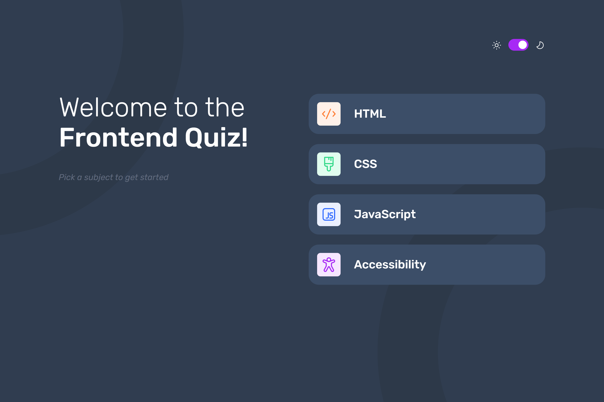

# Frontend Mentor - Frontend quiz app solution

This is a solution to the [Frontend quiz app challenge on Frontend Mentor](https://www.frontendmentor.io/challenges/frontend-quiz-app-BE7xkzXQnU). Frontend Mentor challenges help you improve your coding skills by building realistic projects.

## Table of contents

- [Overview](#overview)
  - [The challenge](#the-challenge)
  - [Screenshot](#screenshot)
  - [Links](#links)
- [My process](#my-process)
  - [Built with](#built-with)
  - [What I learned](#what-i-learned)
- [Author](#author)

## Overview

### The challenge

Users should be able to:

- Select a quiz subject
- Select a single answer from each question from a choice of four
- See an error message when trying to submit an answer without making a selection
- See if they have made a correct or incorrect choice when they submit an answer
- Move on to the next question after seeing the question result
- See a completed state with the score after the final question
- Play again to choose another subject
- View the optimal layout for the interface depending on their device's screen size
- See hover and focus states for all interactive elements on the page
- Navigate the entire app only using their keyboard
- **Bonus**: Change the app's theme between light and dark

### Screenshot

### Links

- [Solution URL](https://github.com/Antonvasilache/frontend-quiz-app)
- [Live Site URL](https://frontend-quiz-app-av.netlify.app)

## My process

1. Building the static pages as per the figma design.
2. Creating the reducer and context files.
3. Switching the static content to dynamic, using the data.json file.
4. Dynamically rendering the pages using the reducer cases.
5. Adding responsiveness for tablet and mobile.
6. Implementing the dark theme using Context API.

### Built with

- Semantic HTML5 markup
- CSS custom properties
- Flexbox
- React
- Context API
- useReducer

### What I learned

- Using the useReducer hook to manage complex state.
- Using Context API to implement color themes.
- Experimenting with various ways of handling image loading

## Author

- Website - [Antonvasilache.com](https://www.antonvasilache.com)
- Frontend Mentor - [@Antonvasilache](https://www.frontendmentor.io/profile/Antonvasilache)
